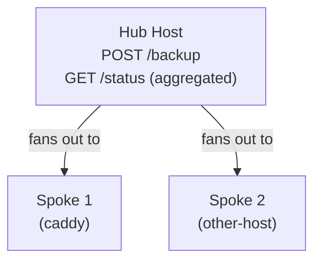

# flask-container-backup

A lightweight, self-hosted Flask server that stops a Docker container, zips up its local volume data, and uploads the archive to a remote destination. Designed to run as a Docker container alongside your existing stack.

[](https://hub.docker.com/r/zackwag/flask-container-backup)
[](LICENSE)
[](https://flask.palletsprojects.com/)

---

## Overview

`flask-container-backup` exposes a simple REST API for triggering on-demand or scheduled backups of Docker containers. Each backup stops the target container, compresses the source folder into a timestamped zip archive, uploads it to the configured destination, and applies retention cleanup to remove old backups beyond a specified number of days.

v2.0 introduces a **hub/spoke architecture** that allows a single backup trigger to fan out across multiple Docker hosts, with aggregated status reporting.

---

## Features

- **Per-container endpoints** — Trigger a backup for any individual container via `POST /backup/<container_name>`
- **Backup all at once** — Trigger all configured container backups simultaneously via `POST /backup`
- **Non-blocking** — Backups run in background threads and return immediately with a `202 Accepted` response
- **Retention management** — Automatically removes backups older than the configured number of days
- **JSON-driven config** — Define all containers and their backup settings in a single `containers.json` file
- **Cloud upload support** — Works with OneDrive and other rclone-compatible destinations
- **Hub/spoke architecture** — Fan out backups across multiple Docker hosts from a single trigger
- **Status endpoint** — Query backup status across all hosts via `GET /status`

---

## Hub / Spoke Architecture

`flask-container-backup` supports two modes controlled by the `MODE` environment variable:

**Spoke** (default) — backs up local containers only. Exposes `/backup`, `/backup/<container>`, and `/status` (local result only).

**Hub** — everything a spoke does, plus fans out to all configured spokes on `/backup` and aggregates their statuses on `/status`. Requires a valid `spokes.json` file -- fatal error on startup if missing or empty.



---

## Quick Start

### 1. Pull the image

```bash
docker pull zackwag/flask-container-backup
```

### 2. Create your config files

**`containers.json`** — defines which containers to back up:

```json
[
  {
    "container_name": "my-app",
    "source_folder": "/docker/my-app",
    "destination_folder": "Onedrive:/backups/my-app",
    "retention_days": 7
  },
  {
    "container_name": "another-app",
    "source_folder": "/docker/another-app",
    "destination_folder": "Onedrive:/backups/another-app",
    "retention_days": 14
  }
]
```

**`spokes.json`** (hub mode only) — defines remote spoke agents:

```json
[
  {
    "name": "caddy",
    "url": "http://192.168.4.89:2128"
  }
]
```

### 3. Run the container

```yaml
services:
  container-backup:
    image: zackwag/flask-container-backup:latest
    container_name: container-backup
    restart: unless-stopped
    ports:
      - 2128:2128
    volumes:
      - /var/run/docker.sock:/var/run/docker.sock:ro
      - /docker/container-backup/config:/app/config
      - /docker:/source
    environment:
      - PYTHONUNBUFFERED=1
      - TZ=America/New_York
      - MODE=spoke
```

> All config files (`containers.json`, `spokes.json`, `backup_result.json`) live in `/app/config` inside the container. Mount your config directory there.

---

## Environment Variables

| Variable | Default | Description |
|---|---|---|
| `MODE` | `spoke` | Run mode. `spoke` or `hub` |
| `TZ` | UTC | Timezone |
| `PYTHONUNBUFFERED` | -- | Set to `1` for real-time logs |

---

## API Reference

| Method | Endpoint | Description |
|---|---|---|
| `POST` | `/backup` | Trigger a backup for all local containers (and fan out to spokes in hub mode) |
| `POST` | `/backup/<container_name>` | Trigger a backup for a specific container |
| `GET` | `/status` | Return backup status (aggregated across all spokes in hub mode) |

### Example

```bash
# Trigger all backups
curl -X POST http://localhost:2128/backup

# Trigger a specific container backup
curl -X POST http://localhost:2128/backup/my-app

# Check status
curl http://localhost:2128/status
```

### Backup Response

```json
{
  "status": "Backup started"
}
```

### Status Response (spoke)

```json
{
  "overall_status": "success",
  "local": {
    "status": "success",
    "containers_backed_up": ["my-app", "another-app"],
    "errors": [],
    "timestamp": "2026-04-08T09:22:28.218794"
  }
}
```

### Status Response (hub)

```json
{
  "overall_status": "success",
  "local": {
    "status": "success",
    "containers_backed_up": ["my-app"],
    "errors": [],
    "timestamp": "2026-04-08T09:22:29.728880"
  },
  "spokes": [
    {
      "spoke": "http://192.168.4.89:2128",
      "result": {
        "overall_status": "success",
        "local": {
          "status": "success",
          "containers_backed_up": ["caddy", "caddy-ui-backend"],
          "errors": [],
          "timestamp": "2026-04-08T09:22:28.218794"
        }
      }
    }
  ]
}
```

---

## Home Assistant Integration

The `/status` endpoint integrates cleanly with Home Assistant via a REST sensor:

```yaml
rest:
  - resource: http://your-hub-host:2128/status
    scan_interval: 60
    sensor:
      - name: Container Backup Status
        value_template: "{{ value_json.overall_status }}"
        unique_id: container-backup-status
```

Trigger backups via `rest_command`:

```yaml
rest_command:
  backup_containers:
    url: http://your-hub-host:2128/backup
    method: POST
```

---

## Configuration Reference

**`containers.json`** fields:

| Field | Description |
|---|---|
| `container_name` | The name of the Docker container to back up |
| `source_folder` | Local path to the container's data directory |
| `destination_folder` | Remote destination path (rclone-compatible) |
| `retention_days` | Number of days to retain backups before cleanup |

**`spokes.json`** fields (hub mode only):

| Field | Description |
|---|---|
| `name` | Friendly name for the spoke |
| `url` | Base URL of the spoke's flask-container-backup instance |

---

## Building from Source

```bash
git clone https://github.com/zackwag/flask-container-backup
cd flask-container-backup
docker build -t flask-container-backup .
```

---

## Docker Hub

[https://hub.docker.com/r/zackwag/flask-container-backup](https://hub.docker.com/r/zackwag/flask-container-backup)

---

## License

MIT
